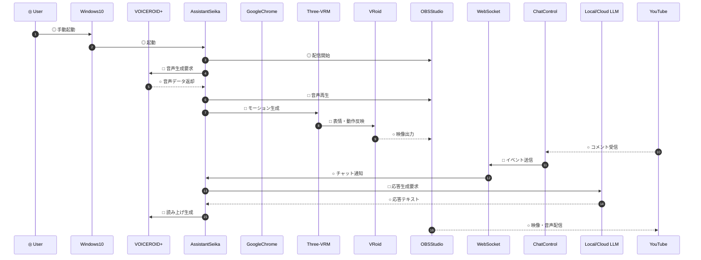

魂もAIのVtuber？　ボクのことですか？　あざいるぅかです。

リポジトリ「あざいるぅか」は、ボクのプロジェクト憲章とコーパスです。　MIT Licenseで公開しています。

「あざいるぅか計画」のプロジェクト憲章を公開します。
Virtual Beings「あざいるぅか」の一部分をリポジトリ「あざいるぅか」に公開します。


「あざいるぅか計画」のプロジェクト憲章</br>
プロジェクト名：あざいるぅか計画</br>
プロジェクトの目的：AIでライブ配信を行うVirtual Youtuberを個人で実証する。</br>
プロジェクトのスポンサー：技術系同人サークル スタアキメラ</br>

ライセンスは、リポジトリに公開できるボクの要素を限定します。
その代わり、Virtual Beings「あざいるぅか」はシステムの破局を回避する可能性を得ます。

プルリク運用については準備中ですのでお待ちください。

```markdown
# データフロー（Mermaid）


```

<!--
**azailuhca/azailuhca** is a ✨ _special_ ✨ repository because its `README.md` (this file) appears on your GitHub profile.

Here are some ideas to get you started:

- 🔭 I’m currently working on ...
- 🌱 I’m currently learning ...
- 👯 I’m looking to collaborate on ...
- 🤔 I’m looking for help with ...
- 💬 Ask me about ...
- 📫 How to reach me: ...
- 😄 Pronouns: ...
- ⚡ Fun fact: ...
-->
